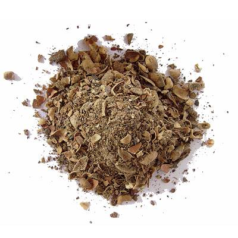
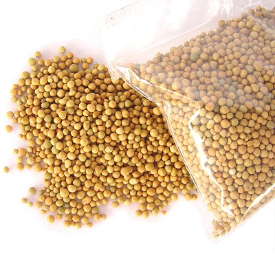

<main class="main">

Alimentar regularmente durante a estação de crescimento é crucial para que seu Bonsai sobreviva. As árvores normais são capazes de estender seu sistema radicular procurando nutrientes; os Bonsai, no entanto, são plantados em vasos pequenos e precisam ser adubados, a fim de repor o conteúdo nutricional do solo.

É muito importante escolher o adubo certo: durante a época de início da primavera use um adubo com um teor de Nitrogênio relativamente alto (algo como NPK 12:6:6) para impulsionar o crescimento da árvore. Durante o verão, use um adubo mais equilibrado (como NPK 10:10:10); enquanto que durante o outono, use um adubo para endurecer a árvore para o próximo inverno (como NPK 3:10:10). Os valores de NPK mencionados são proporções, o que significa que 5:5:5 não é, de fato, diferente de 10:10:10 etc.

Algumas exceções são importantes de se ressaltar: para estimular o Bonsai a florescer, use um adubo com alto teor de Potássio (K) (como NPK 6:6:12) e para árvores mais antigas, você pode usar adubo com teor de Nitrogênio (N) um pouco mais baixo ou reduzir a quantidade de adubo aplicado. Lorem ipsum dolor sit amet, consectetur adipisicing elit. Exercitationem fuga, sit. Voluptatibus repellat impedit incidunt voluptatum praesentium? Error voluptatum asperiores eligendi similique dignissimos nam dolor id excepturi quia cupiditate, possimus architecto enim necessitatibus mollitia consequatur cumque! Sit similique, nobis, excepturi velit dolores magnam quos voluptates unde adipisci praesentium quidem. Officia ex eaque alias laboriosam doloribus atque odio, velit repellendus? Odio est et illo sint tempora harum voluptate. Nobis enim itaque placeat neque veniam quisquam, culpa voluptas qui pariatur in molestias voluptatum! Impedit iure laudantium veritatis dolores saepe totam asperiores vitae quis, modi qui ea voluptatem illo eaque est, earum accusantium. Lorem ipsum dolor sit amet, consectetur adipisicing elit. Obcaecati sit quam repudiandae, illo numquam distinctio, soluta at non porro voluptate dolor ex impedit laboriosam magnam provident aliquid officiis suscipit vitae pariatur. Assumenda, eum vitae. Commodi fuga alias, illo blanditiis, repellat facere consectetur vel temporibus velit deleniti voluptatibus in, iure, nisi sequi ad mollitia ratione asperiores debitis. Nam error, dolorum facilis omnis? Tempora porro provident eaque laboriosam cumque optio eos illum necessitatibus animi harum deserunt quibusdam vitae maxime dolor fugit, ipsam illo nisi? Eius voluptatem dolorum amet voluptates corporis et tempore exercitationem necessitatibus debitis vitae possimus, molestiae aliquam, at voluptate nulla deleniti natus consectetur suscipit. Excepturi doloribus officiis ducimus ut nobis fugiat nihil cum eum laudantium pariatur, enim, in labore doloremque, aliquid dolorum eius libero minus ipsum voluptatum nam nemo repudiandae rerum? Reiciendis quod labore magni laudantium deleniti, quia quos quae aut corrupti soluta ab natus voluptatum neque debitis repellendus impedit dolores earum veritatis ducimus, quibusdam? Quidem harum ratione eligendi perspiciatis earum ea nisi eaque doloribus deserunt temporibus excepturi, ullam mollitia minima dolorum! Laboriosam temporibus quo, animi, porro iusto, a esse veniam repudiandae illum possimus quae. Amet officia, beatae velit nihil odio ex at, tenetur quis incidunt modi ad numquam eos odit itaque ipsum provident quas est nemo eveniet quaerat blanditiis ea? Dolor tempore ipsa eius deleniti ratione vel culpa autem fuga quasi nulla quaerat, dignissimos nostrum nihil asperiores, eveniet, fugit nesciunt quam. Facere maiores molestiae omnis consectetur aliquam, nemo saepe quas, quia reiciendis, rerum pariatur quo iste expedita officia porro, fugiat commodi! Nobis accusamus iusto, laboriosam dolores, eveniet, fugit laudantium totam fugiat ducimus reprehenderit repellat at. Modi incidunt recusandae omnis neque earum nemo, cupiditate odio, dolore, natus tenetur nihil iste in fuga et saepe est obcaecati adipisci dignissimos mollitia magnam ea a. Quibusdam laudantium ab veniam tempora ipsam deleniti nam veritatis deserunt laborum, pariatur eos, velit consequatur. Consectetur sit, incidunt aliquam mollitia iste ad perspiciatis, placeat atque modi, fugit aut accusantium quo magni! Quos aliquid sequi eaque ab expedita quasi est sint. Veritatis maxime deleniti ut corrupti nobis ab cumque nisi optio? Cum esse sunt delectus, hic necessitatibus maxime quibusdam perspiciatis sit! Aut non fuga officia dolores quo vero quisquam obcaecati perspiciatis maxime, ducimus in ipsa minus nulla repellat excepturi, nobis, similique harum ullam necessitatibus tempora. Tenetur necessitatibus deserunt iste natus beatae, quasi maiores nemo doloremque, recusandae atque consequuntur placeat veniam totam sapiente eligendi soluta illo fugit vero cum quia ipsa debitis! Eligendi esse molestiae aperiam quas animi voluptatibus enim ullam quod. Non voluptas quidem similique ex, excepturi distinctio impedit dolor nesciunt veritatis cum officia rerum nemo accusamus at inventore delectus provident. Commodi voluptatum molestiae possimus quam eaque harum et debitis illo sit amet ducimus, quibusdam iure neque pariatur est quo, impedit repellat quas minima beatae atque nam modi perferendis? Reprehenderit sapiente, delectus tenetur vel fugiat! Impedit, dicta dolores expedita architecto, dolorum ipsa assumenda. Dolorum suscipit labore quaerat cum repudiandae voluptas asperiores adipisci incidunt. Illum placeat similique rerum doloribus ut, fuga est numquam consequatur non veniam, cumque id rem, cum.

</main>
