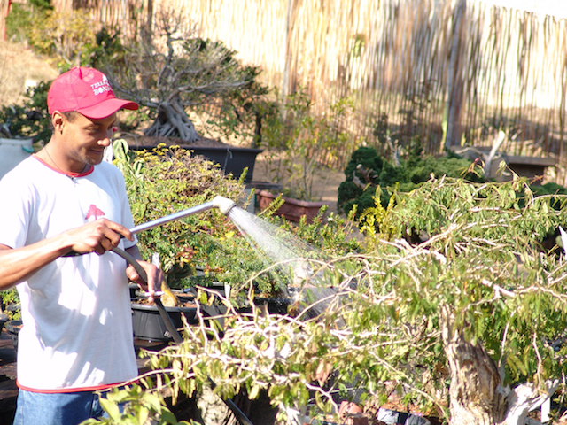

<main class="main">

    Este é o ponto mais importante no cultivo do bonsai, depois dele vem o solo e a iluminação.
    Visto que: Se você não regar corretamente a sua planta, ela morre !
    Por isso, preste atenção nas regras abaixo:

    • Regue suas plantas, preferencialmente pela manhã, bem cedo.
    • Regue com calma, até Ter certeza de que o solo está completamente molhado e que esteja vazando água pelos furos de drenagem.
    • Não mantenha pratinhos cheios de água em baixo do vaso, pois o acúmulo de água irá apodrecer as raízes.
    • Nos dias quentes de verão, regue mais de uma vez, evitando os horários de sol intenso.
    • No inverno, reduza a periodicidade da rega.
    • De modo geral, regue sempre que a superfície do solo estiver seca.
    • Borrife as folhas, sempre que estiverem empoeiradas ou quando o dia estiver quente. Evitando molhar as flores e o horário de sol intenso.

    Lorem ipsum dolor sit amet, consectetur adipisicing elit. Deleniti vitae aspernatur ea culpa possimus eos molestiae excepturi, suscipit libero debitis soluta, quidem consequuntur nihil voluptatibus tempora praesentium ipsum commodi quisquam consectetur quasi quia eaque! Cumque impedit quaerat sint, sunt et consequatur fuga mollitia ipsa assumenda aliquid error illo vel ut repellat! Accusamus, illo molestias, voluptatem minima sapiente debitis amet dicta ratione placeat aliquid odit iste excepturi cum tempore eligendi minus. Excepturi itaque iste neque sint fugit necessitatibus voluptate, deserunt, quam quis dolorum laudantium nobis nam dolore voluptatibus nulla harum ipsum minima. Fuga perspiciatis culpa, iusto, sed ducimus quos! Aperiam, sunt!

</main>
