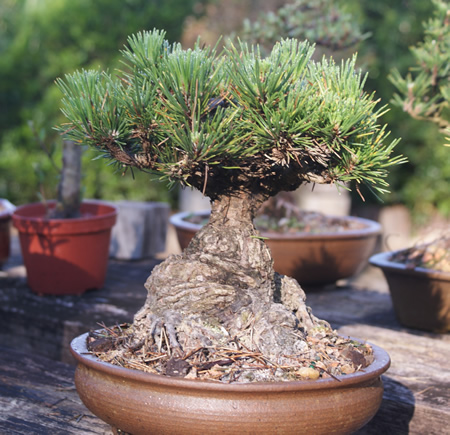

<main class="main">

Este é outro ponto muito importante no cultivo do bonsai.

Muitas pessoas compram ou ganham um "bonsai" e o colocam em cima da geladeira ou na estante da sala, achando que este é o lugar certo para ele. Desta forma, privam o coitadinho de luz solar direta e o colocam em um ambiente fechado, quente e abafado.

Lembre-se que o bonsai é uma árvore ! Ele não é um pingüim de geladeira e nem um livro ou porta retrato. O bonsai necessita de um lugar fresco, arejado e que proporcione de 4 a 8 horas de sol direto, por dia.

Em locais muito frios, o bonsai deve ser protegido dos ventos e da geada. Em locais com temperatura entre 10ºC e 25ºC, o bonsai pode ficar o dia inteiro no sol. Em climas quentes, acima de 30ºC, o bonsai deve ser protegido do sol intenso, podendo ser utilizado uma tela de sombrite 50%.

Num dia especial, quando queremos enfeitar a sala ou a estante com um bonsai, é claro que podemos tirar nossa arvorezinha do sol e colocá-la dentro de casa, num ambiente sem luz solar.

Mas lembre-se de molha-la antes.

Você pode deixar seu bonsai fora do sol, por um período de no máximo 48 horas. Depois deste período, ele deve voltar ao seu ambiente ensolarado.

Lorem ipsum dolor sit amet, consectetur adipisicing elit. Tempora, mollitia placeat vero quaerat, maxime voluptates atque eos nam optio porro eligendi illum iusto consequatur ducimus maiores ex officiis dolorem, reprehenderit a minus! Consectetur laboriosam sequi officia aperiam tempora, expedita ut earum voluptatem adipisci distinctio beatae fuga esse quasi animi repellat? Quibusdam dignissimos, perferendis. Eaque facilis nisi molestias omnis, earum sequi illo temporibus voluptate dicta libero quia illum eius, corporis amet deserunt voluptas ducimus commodi! Illum autem eaque magnam. Aperiam quam corporis cupiditate, suscipit nesciunt asperiores sed in voluptatibus labore alias, porro vero sapiente laborum accusamus fugiat nostrum dolores ipsum. Fugit tempore praesentium, dignissimos quia, illo consectetur perferendis culpa asperiores adipisci cum, nemo deserunt magnam similique aliquam a ut temporibus. Veniam doloribus et temporibus distinctio non dolor porro, corporis, voluptatem quibusdam sunt alias fuga, vero sint quas numquam laborum est blanditiis ipsa modi voluptate aperiam aliquam! Distinctio sunt sint ex et, voluptatum, neque nisi maiores, officia fugiat aliquid ad, obcaecati consequuntur eligendi tempora iure sed reprehenderit. Quis, distinctio provident, ratione consectetur aperiam voluptas itaque laboriosam possimus cupiditate blanditiis explicabo! Odio eum impedit ratione aspernatur voluptates est accusamus eveniet aut consectetur sit, et magni facilis, dignissimos, dolores. Amet obcaecati, hic repudiandae necessitatibus?

</main>
