<main class="main">
    

        <ol class="portfolio">
        
Ao começar um trabalho com vistas à criação de um bonsai, é preciso ter em mente que os melhores resultados são obtidos sempre que o estilo a seguir respeite a aptidão da planta a ser trabalhada. Assim feito, o bonsai terá a naturalidade desejada.
        

            <li>
            <figure>
            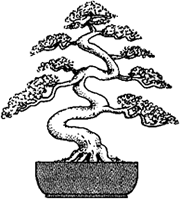
<!--            -->
            
ESPIRAL - BANKAN
            Dos estilos de Bonsai, talvez esse seja o mais diferente. Algumas árvores se retorcem devido às condições de composição do solo. O empobrecimento do mesmo e a salinidade fazem com que as árvores da beira do mar retorçam seus troncos. No alto de algumas montanhas os ventos ciclônicos e composição do solo também  forçam os troncos a se retorcer. Estas formas podem ser observadas em pinturas do período Edo e Muromachi do Japão.

            </figure>
            </li>
            <li>
            <figure>
            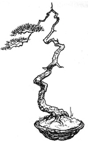
            
LITERATO - "BUNJIN-GI"
            É o estilo em que a predominância de massa verde encontra-se no alto do bonsai. Caracteriza-se por linhas fluídas, limpas e elegantes. Este estilo "adota" outros estilos para a sua existência - podemos ter o literato "sôbre" os estilos vertical, inclinado, cascata e outros. 

            </figure>
            </li>
            <li>
            <figure>
            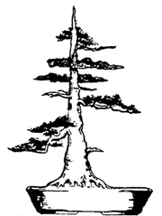
            
VERTICAL FORMAL - "CHOKKAN"
            Como o próprio nome indica, o tronco é vertical e absolutamente reto, com perfeita conicidade e galhos em todas as direções. Na natureza, árvores desta conformação indicam um crescimento livre de adversidades. Este estilo representa o máximo de equilíbrio, sendo, para tanto, fundamental um nebari bem formado por raízes fortes e dispostas radialmente.
            

            </figure>
            </li>
            <li>
            <figure>
            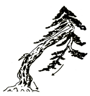
            
INCLINADO - "SHAKAN"
            O tronco deve estar inclinado no mínimo 30º para um dos lados da árvore. Os galhos devem ser menores nos ângulos internos da árvore e maiores no externo, devem ser triangulados ou ter a forma de cúpula e ter a sua forma e movimento visual seguindo a de todo o conjunto.

            </figure>
            </li>
            <li>
            <figure>
            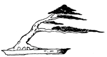
            
VARRIDO PELO VENTO - "FUKINAGASHI"
            Como definido pelo nome, indica o desenvolvimento de uma árvore sob o regime de vento predominante, causando a inclinação do tronco naquele mesmo sentido, bem como "marcas" no lado que recebe o vento. Dada esta condição adversa, a copa não apresenta densidade. 

            </figure>
            </li>
            <li>
            <figure>
            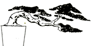
            
SEMICASCATA - "HAN-KENGAI"
            Neste estilo, a árvore também inclina-se para baixo, embora de forma menos acentuada. A parte mais baixa da copa/tronco situa-se próximo da altura do vaso, com inclinação em torno dos 45°.

            </figure>
            </li>
            <li>
            <figure>
            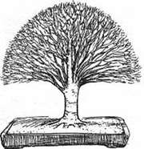
            
VASSOURA - "HOKIDACHI"
            Neste estilo, o tronco é absolutamente reto e vertical, subdividindo-se em inúmeros galhos que, nascendo de um mesmo ponto de tronco e em todas as direções, formam uma única copa. Dada a grande quantidade de galhos que formam a copa, é importante que se elimine aqueles que "atravessem" a copa, possibilitando as melhores ensolação e aeração do conjunto. 

            </figure>
            </li>
            <li>
            <figure>
            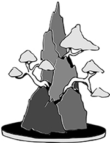
            
RAÍZES SOBRE A ROCHA - "ISHITSUKI"
            Este estilo agrega, além da árvore e da bandeja, um novo elemento da composição: uma pedra. Neste caso as raízes são "altas" e descem a pedra, em forma de "abraço apertado" em direção ao substrato da bandeja. Espaços ou vazios entre as raízes e a rocha reduzem a qualidade do bonsai. Uma variação deste estilo resulta de plantar a árvore na rocha, ou seja, em depressões adequadas para receber o substrato e a árvore. 

            </figure>
            </li>
            <li>
            <figure>
            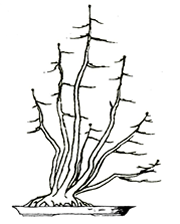
            
TRONCO MÚLTIPLO - "KABUDACHI"
            São considerados tronco múltiplo árvores com cinco ou mais troncos em um único nebari. É muito importante que o trabalho com cada tronco/copa leve em conta o resultado do conjunto, o que, para tanto, alguns troncos podem/devem ser "vistos" como galho. 

            </figure>
            </li>
            <li>
            <figure>
            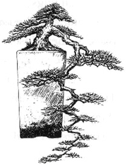
            
CASCATA - "KENGAI"
            No estilo cascata a árvore apresenta forte inclinação vertical no sentido da face lateral da bandeja. A parte mais externa da árvore deve estar em nível inferior ao fundo do vaso. Variações deste estilo apresentam tronco único ou múltiplo, presença ou não de ápice. 

            </figure>
            </li>
            <li>
            <figure>
            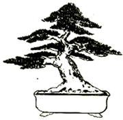
            
VERTICAL INFORMAL - "MOYOGI"
            É o estilo que mais identifica a arte do bonsai - é o mais popular. O tronco é ereto, porém com curvas que o movimentam em todas as direções. O eixo principal da árvore tem que conter o ápice e o nebari (permitidos pequenos desvios). Caso contrário, resultaria o estilo inclinado. 

            </figure>
            </li>
            <li>
            <figure>
            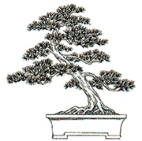
            
INCLINADO - "SHAKAN"
            Neste estilo, o tronco é reto, porém deslocado do seu próprio eixo, ou seja: inclinado. O mais difícil é obter equilíbrio visual com uma árvore com desequilíbrio físico. O equilíbrio visual é buscado através da oposição do ápice, dos galhos e/ou do nebari, ou seja, enfatizando-se em sentido oposto à inclinação do tronco o que de mais favorável se tem do ápice, dos galhos e do nebari. 

            </figure>
            </li>
            <li>
            <figure>
            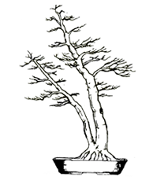
            
TRONCO DUPLO - "SOKAN"
            O estilo tronco duplo é comum na natureza, mas na verdade não é tão comum na arte do Bonsai. Geralmente ambos os troncos vão crescer de um único sistema de raízes, mas também é possível que o menor tronco se desenvolva a partir do tronco maior logo acima do solo. Os dois troncos vão variar em diâmetro e comprimento, o tronco mais grosso e mais desenvolvido cresce quase na vertical, enquanto que o menor tronco vai crescer um pouco inclinado. Ambos os troncos contribuirão para uma única coroa de folhas/copa

            </figure>
            </li>
            <li>
            <figure>
            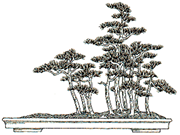
            
BOSQUE OU FLORESTA - "YOUSE-UE"
            São grupos de pelo menos cinco árvores plantadas em conjunto. O número de árvores que compõe o grupo deve ser ímpar, até que se atinja uma quantidade de unidades tão elevada que a contagem dos troncos deixe de ser possível com uma simples observação do conjunto. Também neste estilo prevalece o sentido de grupo - triangulação, profundidade, equilíbrio. A formação do bosque pode ser expressada por dois ou mais sub-grupos, sempre prevalecendo o todo em relação às unidades

            </figure>
            </li>
        </ol>
    

</main>
